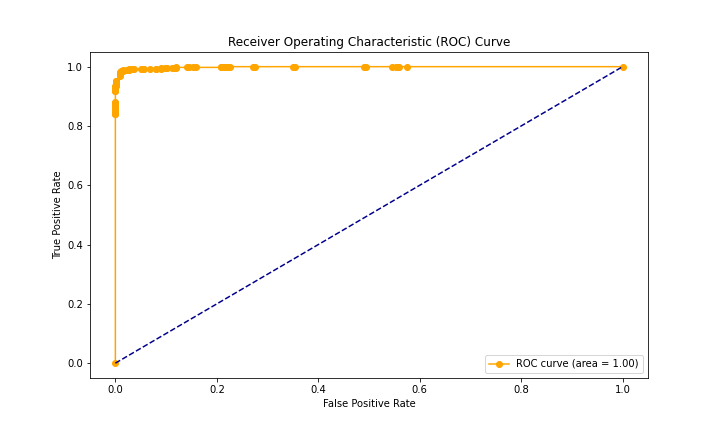

# extinction-prevention-modeling-MO434
This repository contains the final project for the subject MO434 (Deep Learning) at Unicamp.


## Description

This project is a SDM (Species Distribution Modelling) focused on Brazilian vegetal species applied to agriculture. To create the species distributions species occurrences data were extracted from GBIF and environment data were extracted from the bases [ENVIREM](https://envirem.github.io/) and [BIOCLIM](https://www.worldclim.org/data/worldclim21.html).

The statistical technique used was the fully connected Deep Neural Networks. To measure the performance of the algorithm the metrics used were ROC (Receiver Operating Characteristic Curve) and AUC (Area Under Curve). To calculate those metric data were separated in 4 kfolds with the occurrences inference data was defined positives and 100000 randomly picked habitat data defined as negatives.

The project uses multiple strategies to overcome computer resources limitations to big data analyses. The steps on the section Getting Started will detail everything you must to to replicate the project.

## Getting Started


This project was created be run on Google Colab associate with Google Drive. To replicate this project it will be required to follow multiple steps described below:

1.	The first step is create a root folder with any name on Google Drive and put all this structure inside. This is a must do process and will take some hours depending on your internet.

2.	After that, for every .ipynb file from the Pipeline and Prepipeline you must assign the ```project_root``` of your folder on google drive.

3. 	The next step is running the file [Pipeline/PrePipeline/Construct_Framework.ipynb](Pipeline/PrePipeline/Construct_Framework.ipynb). It will fastly recover the files that are also created by [Pipeline/PrePipeline/Standarize_Raster.ipynb](Pipeline/PrePipeline/Standarize_Raster.ipynb). Also inside Prepipeline you must run [Pipeline/PrePipeline/Study_Cases.ipynb](Pipeline/PrePipeline/Study_Cases.ipynb) to create files related with the focused species.

4.	With everythin prepared you must neatly run every step of the Pipeline. If you want to run for only one specie located on the file [species_taxon_id_dict.py](utils/species_taxon_id_dict.py), you must set the ```taxon_key``` parameter of this species and the parameter to ```collect_all=False```. Otherwise if you want to run for all the species set the parameter ```collect_all=True```.

5. Many folders will be automatically created. The results will be located in subfolders with species names inside the folder [Results](/Results).


## Studied Species

The studied species are located on the file [species_taxon_id_dict.py](utils/species_taxon_id_dict.py). Those are:

*	Cariama cristata
*	Pteronura brasiliensis
*	Anodorhynchus hyacinthinus
*	Panthera onca
*	Tapirus terrestris
*	Blastocerus dichotomus
*	Hydrochoerus hydrochaeris
*	Alouatta caraya
*	Myrmecophaga tridactyla
*	Chrysocyon brachyurus
*	Leopardus pardalis
*	Caiman latirostrisa
*	Pulsatrix koeniswaldiana


If you want to execute the project for your own interest species you should create a similiar dictionary structure in evey Pipeline file with the species Scientific Name and the GBIF taxon id. 


## Results

For every case species distributions maps and Kfold ROC curves with average AUC were created. One example for the species Anodorhynchus hyacinthinus cane be verified below:

* Species distribution:


* Kfold ROC and AUC:



The summary of the results can be checked on the table below:

**Species Name**|**Number of occurrences**|**Average AUC**
:-----:|:-----:|:-----:


### Prerequisites

The prerequisites are almost all fulfilled natively by google colab. It was only required to install GeoPandas and Rasterio on the Pipeline and Prepiline files.


## Authors

**Matheus Gustavo Alves Sasso** - [math-sasso](https://github.com/math-sasso)
**Gabriela C. Vechini** - [math-sasso](https://github.com/gvechini)
**Jean Kusanagi** - [math-sasso](https://github.com/JeanKusanagi)

